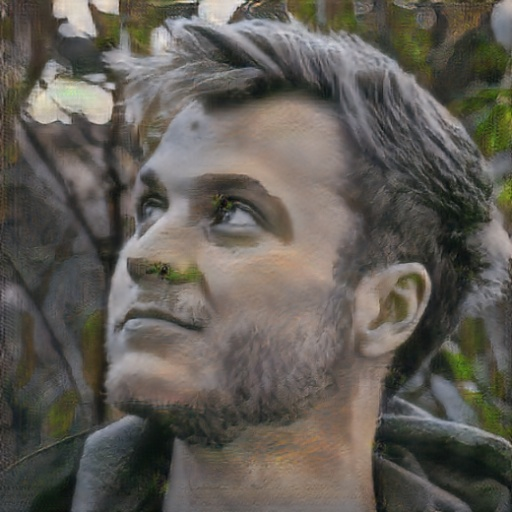

# Temporal CycleGAN

The goal is to create a temporally consistent CylceGAN, based on [Youngwoon Lee's implementation](https://github.com/gitlimlab/CycleGAN-Tensorflow) of a CycleGAN in Tensorflow.

## Dependencies

- Python 3.6
- [Tensorflow 1.5.0](https://www.tensorflow.org/)
- [NumPy](https://pypi.python.org/pypi/numpy)
- [SciPy](https://pypi.python.org/pypi/scipy)
- [Pillow](https://pillow.readthedocs.io/en/4.0.x/)
- [tqdm](https://github.com/tqdm/tqdm)
- OpenCV

## Usage

### Training

- Execute the following command to train a model:

```
$ python train.py --task <taskname>
```

The corresponding `./dataset/<taskname>` directory should contain `trainA` and `trainB` directories containg training
data for domain A and domain B respectively. 

The training data can be either images or videos for each domain. Handling of different data types is done automatically.

Command line options:

- `--task` : Name of the task, specifies the training data directory
- `--batch_size`: Batch size, default is 4 (Empirical sweet spot for GTX 1080ti)
- `--image_size`: Resolution of the training data, default is 256
- `--load_model`: Optional log/checkpoint directory of an existing model, use to continue training

More command line options can be found with `--help`.

Once training, check the status on Tensorboard:

```
$ tensorboard --logdir=./logs
```

> **Carefully check Tensorboard for the first 1000 iterations. You need to run the experiment again if dark and bright regions are reversed like the example below. This GAN implementation is sensitive to the initialization.**


### Inference

Applies a domain transfer using a trained model to an input. Works for images and videos in both A->A an B->A directions. 

Example:

``
python test.py --input "test_image.jpeg" --output "test_output.jpeg" --model_dir "logs/videos_2018-12-01_16-45-08"
``

Command line options:

- `--input` : Name of the input file, defaults to test_image.jpeg`.
- `--output`: Name of the output file, media type should match input type. Note that sound is lost for video transfer. 
Defaults to `test_output.jpeg`
- `--model_dir`: The pretrained model to use (name of the model directory). If none is given it will automatically use 
the latest trained model.
- `--backwards`: Optional flag to perform B->A inference instead of the default A->B.

More command line options can be found with `--help`.

## Results

Example on the domains "Photos" and "[Ukiyo-e](https://en.wikipedia.org/wiki/Ukiyo-e)" trained with images only. Training took 10 hours on a GTX 1080ti.

<p align = 'center'>



</p>

Example on the domains "Horse" and "Zebra" trained with images only (no temporal consistency).

<p align = 'center'>


</p>
